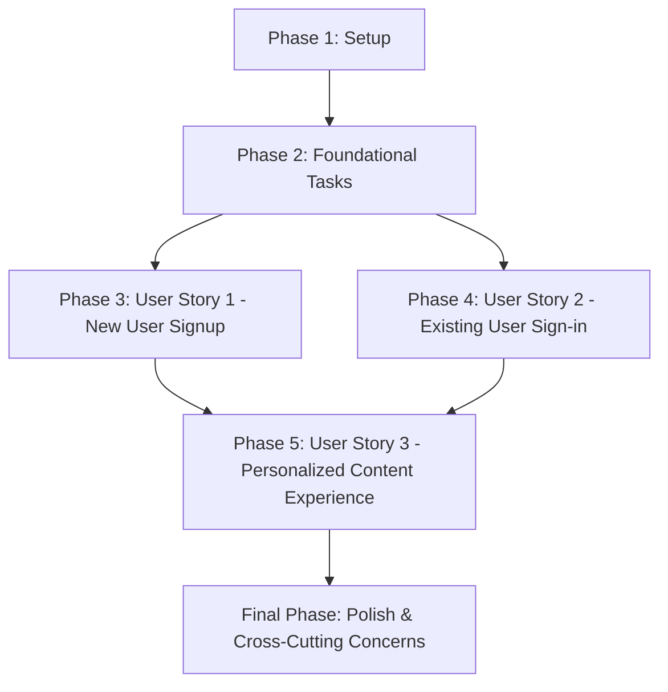

# Tasks: Better-Auth & Personalization Integration

**Feature Branch**: `1-better-auth-personalization`
**Date**: 2025-12-13
**Spec**: [specs/1-better-auth-personalization/spec.md](specs/1-better-auth-personalization/spec.md)
**Plan**: [specs/1-better-auth-personalization/plan.md](specs/1-better-auth-personalization/plan.md)

This document outlines the tasks required to implement the Better-Auth & Personalization Integration feature, organized by user story and phased for incremental delivery.

## Dependency Graph

## Parallel Execution Examples

*   **Setup Phase**: Tasks in this phase are mostly sequential.
*   **Foundational Phase**: Tasks are sequential.
*   **User Story 1 (New User Signup)**: Frontend form and backend endpoint can be developed in parallel up to integration.
*   **User Story 2 (Existing User Sign-in)**: Frontend form and backend endpoint can be developed in parallel up to integration, and can be parallelized with US1 once foundational tasks are complete.
*   **User Story 3 (Personalized Content Experience)**: Backend data retrieval and frontend content adaptation can be parallelized, but depend on US1 and US2 for user creation and login.

---

## Phase 1: Setup

**Goal**: Configure external services and project environment.

-   [x] T001 Configure Better-Auth service and obtain API credentials in environment variables (e.g., `.env`).
-   [x] T002 Install necessary backend (Node.js, if applicable) and frontend (React/Docusaurus) dependencies in `temp-docusaurus-site/package.json`.

---

## Phase 2: Foundational Tasks

**Goal**: Implement core data structures and client for Better-Auth interaction.

-   [x] T003 Create TypeScript interfaces/types for `User` and `Personalization Data` in `temp-docusaurus-site/src/types/auth.ts`.
-   [x] T004 Implement a Better-Auth API client service (e.g., `BetterAuthService.ts`) to handle communication with `https://www.better-auth.com/` in `temp-docusaurus-site/src/services/BetterAuthService.ts`.

---

## Phase 3: User Story 1 - New User Signup (P1)

**Goal**: Enable new users to register and store their personalization data.

**Independent Test**: A user can navigate to the signup page, fill in all required information including background data, successfully register, and receive confirmation of account creation.

-   [x] T005 [P] [US1] Create the frontend signup form (`/auth/signup`) using React components in `temp-docusaurus-site/src/pages/signup.tsx` to collect email, password, and structured technical background data.
-   [x] T006 [P] [US1] Implement the backend endpoint `/api/auth/register` (e.g., in a Node.js Express route or serverless function) to:
    *   Call Better-Auth API to create the user.
    *   Store personalization data using Better-Auth's User Metadata/Profile endpoint.
    *   Return a `201 Created` status with optional session token.
-   [x] T007 [US1] Implement client-side validation and error display for signup form in `temp-docusaurus-site/src/pages/signup.tsx`.
-   [x] T008 [US1] Implement user-friendly error messages and basic retry logic for Better-Auth failures during signup in the backend `/api/auth/register` handler.

---

## Phase 4: User Story 2 - Existing User Sign-in (P1)

**Goal**: Allow existing users to sign in securely.

**Independent Test**: A user can navigate to the sign-in page, enter their registered credentials, successfully sign in, and be redirected to a personalized dashboard.

-   [x] T009 [P] [US2] Create the frontend sign-in form (`/auth/signin`) using React components in `temp-docusaurus-site/src/pages/signin.tsx` to collect email and password.
-   [x] T010 [P] [US2] Implement the backend endpoint `/api/auth/login` (e.g., in a Node.js Express route or serverless function) to:
    *   Authenticate with Better-Auth API.
    *   Set a secure HTTP-only cookie with the session token and expiration time.
    *   Return a `200 OK` status or redirect to a personalized dashboard.
-   [x] T011 [US2] Implement client-side validation and error display for sign-in form in `temp-docusaurus-site/src/pages/signin.tsx`.
-   [x] T012 [US2] Implement user-friendly error messages and basic retry logic for Better-Auth failures during sign-in in the backend `/api/auth/login` handler.
-   [x] T013 [US2] Configure the frontend application to properly handle and utilize the HTTP-only session cookie for authenticated requests.

---

## Phase 5: User Story 3 - Personalized Content Experience (P2)

**Goal**: Dynamically adapt AI-book content based on user's technical background.

**Independent Test**: A logged-in user with specific background data (e.g., Python experience) views content that demonstrates Python-specific examples.

-   [x] T014 [P] [US3] Implement backend logic to retrieve personalization data for a logged-in user using their Better-Auth User ID in `temp-docusaurus-site/src/services/PersonalizationService.ts`.
-   [x] T015 [P] [US3] Implement frontend logic to fetch and consume personalization data in `temp-docusaurus-site/src/components/PersonalizedContent.tsx`.
-   [x] T016 [US3] Implement content adaptation mechanism to dynamically modify AI-book content based on personalization data in `temp-docusaurus-site/src/components/PersonalizedContent.tsx` or relevant Docusaurus theme component.

---

## Final Phase: Polish & Cross-Cutting Concerns

**Goal**: Ensure quality, performance, and maintainability across the feature.

-   [x] T017 Implement unit tests for all Better-Auth client, backend endpoints, and personalization services (e.g., using Jest).
-   [x] T018 Implement integration tests for signup, sign-in, and personalized content retrieval flows (e.g., using React Testing Library or Playwright for e2e).
-   [x] T019 Conduct security review for authentication flows and data handling.
-   [x] T020 Update relevant Docusaurus navigation or layout components to include links to `/auth/signup` and `/auth/signin`.
-   [x] T021 Document API endpoints and usage in `docs/auth-integration.md`.

---